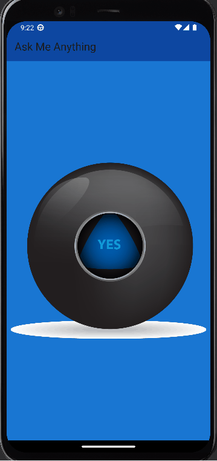

# magic_ball🎱

## Overview
The Magic 8 Ball app is a simple, fun project built using Flutter to help solidify your understanding of Stateless and Stateful widgets. By pressing the ball, you get a random answer to any question you ask—just like a real Magic 8 Ball!

## Demo Video

## Our Goal
This project is an extension of the concepts you learned in the Dicee tutorial. The main goal is to reinforce your knowledge of widget states and interaction handling in Flutter.

## Features
- Press the Magic 8 Ball to get a random answer to your question.
- Dynamic image change using StatefulWidget to randomly display one of 5 ball images.
- Clean, simple UI with responsive interaction.

## 📚 Resources
- **Flutter Documentation**: [flutter.dev](https://flutter.dev)
- **Dart Language**: [dart.dev](https://dart.dev)
- **Course Reference**: *The Complete Flutter Development Bootcamp with Dart* by Angela Yu  
